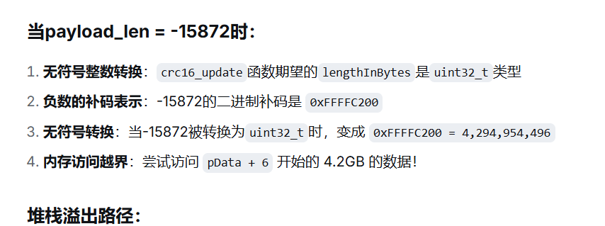

# 串口ORE问题

## 问题描述：  

一上电，单片机运行时，发现所有串口都ORE，并且进入` void HardFault_Handler(void)`函数的死循环之中。

## 问题根因：
堆栈溢出问题。

## 问题发现过程：
- #### 逐个串口进行接收，发现是陀螺仪的串口有问题。
- #### 发现每次ORE都会出现一个共同的状况，就是陀螺仪的接收数组出现错帧。
- #### 把数据处理前面的判断条件（帧头，crc校验）全部注释掉，发现基本没有出现ORE问题。
- #### 逐步放开注释，发现是CRC校验函数出现问题。
```c++
void crc(uint8_t *pData)
{
    payload_len = Length1 + (Length2 << 8);
    crc_calculated = 0;
    crc16_update(&crc_calculated, pData, 4);
    crc16_update(&crc_calculated, pData + payload_len);
    crc_received = CRC1 + (CRC2 << 8);
    if(crc_calculated == crc_received)
    {
        CRC_flag = true;
    }
    else 
    {
        CRC_flag = false;
    }
}
```
- #### 逐步开放注释CRC函数中的函数，发现以下函数都没有出现问题。
```c++
    payload_len = Length1 + (Length2 << 8);
    crc_calculated = 0;
    crc16_update(&crc_calculated, pData, 4);
```
- #### 直到开放`crc16_update(&crc_calculated, pData + payload_len);`函数时就出现了ORE问题。

- #### 观察`payload_len`这个变量，发现当错帧时其去到了-15872，也就是说



## 结论：由于数据错帧，导致CRC校验中的这个`payload_len`变量的值变得特别大，造成访问区域出现问题，最终导致堆栈溢出。
  
## 问题解决方法：

### <span style="color:red;">增加帧头搜索功能。</span>

- 原代码如下：
```c++

            void DataUpdate(uint8_t *pData)
            {
                this->updateTimestamp();
                Verify(pData + frame_start);
                    
                if(GetVerify())
                {
                    // 解析加速度数据 (单位: g)
                    acc[0] = this->R4(pData+offset+12);
                    acc[1] = this->R4(pData+offset+16);
                    acc[2] = this->R4(pData+offset+20);
                    
                    // 解析角速度数据 (单位: °/s)
                    gyro[0] = this->R4(pData+offset+24);
                    gyro[1] = this->R4(pData+offset+28);
                    gyro[2] = this->R4(pData+offset+32);
                    
                    // 解析欧拉角数据 (单位: °)
                    angle[0] = this->R4(pData+offset+48);
                    angle[1] = this->R4(pData+offset+52);
                    angle[2] = this->R4(pData+offset+56);
                    
                    // 解析四元数数据
                    quaternion[0] = this->R4(pData+offset+60);
                    quaternion[1] = this->R4(pData+offset+64);
                    quaternion[2] = this->R4(pData+offset+68);
                    quaternion[3] = this->R4(pData+offset+72);
                }

            }
```

- 新修改后的代码如下：
```c++
        void DataUpdate(uint8_t *pData)
            {
                this->updateTimestamp();
                int frame_start = -1;
                for(int i = 0; i < 82 - 6; i++)  // 在整个缓冲区中搜索
                {
                    if(pData[i] == 0x5A && pData[i+1] == 0xA5)
                    {
                        uint8_t len_low = pData[i+2];
                        uint8_t len_high = pData[i+3];
                        int possible_len = len_low + (len_high << 8);
                            
                        // 检查长度是否合理
                        if(possible_len == 76)
                        {
                            frame_start = i;
                            break;
                        }
                    }
                }
                    
                if(frame_start < 0)
                {
                    return;
                }
                    
                // 从找到的帧头位置开始验证
                Verify(pData + frame_start);
                    
                if(GetVerify())
                {
                    // 解析加速度数据 (单位: g)
                    acc[0] = this->R4(pData+offset+12);
                    acc[1] = this->R4(pData+offset+16);
                    acc[2] = this->R4(pData+offset+20);
                    
                    // 解析角速度数据 (单位: °/s)
                    gyro[0] = this->R4(pData+offset+24);
                    gyro[1] = this->R4(pData+offset+28);
                    gyro[2] = this->R4(pData+offset+32);
                    
                    // 解析欧拉角数据 (单位: °)
                    angle[0] = this->R4(pData+offset+48);
                    angle[1] = this->R4(pData+offset+52);
                    angle[2] = this->R4(pData+offset+56);
                    
                    // 解析四元数数据
                    quaternion[0] = this->R4(pData+offset+60);
                    quaternion[1] = this->R4(pData+offset+64);
                    quaternion[2] = this->R4(pData+offset+68);
                    quaternion[3] = this->R4(pData+offset+72);
                }

            }

```